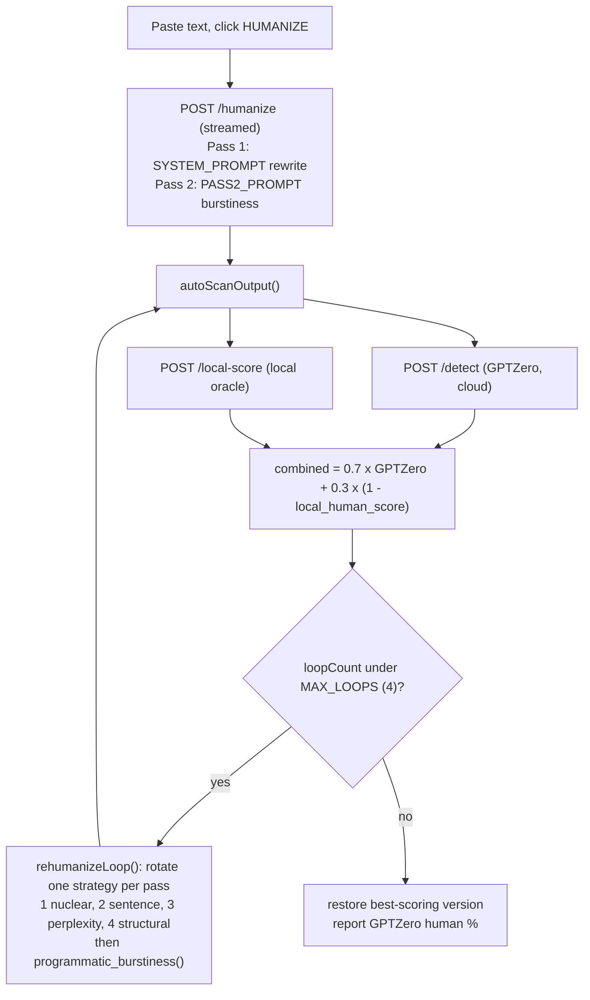

# Humanizer


Strips LLM fingerprints from text. Rewrites AI-generated prose to read as authentically human-written: removes hedging language, em dashes, over-structured bullets, filler openers, and other telltale patterns. Preserves all original meaning, facts, and sentential logic.

## Features

- Matter-of-fact voice: no opinion, no slang, no first-person additions
- Input-grounded language: never introduces vocabulary not in the original
- Sentential logic preservation: causality, conditionals, negation, and hedge level all intact
- Multi-pass rewriting: structural, perplexity, sentence, and nuclear (fact-extract → rewrite-from-scratch) passes
- Nuclear rewrite is on by default and runs first in the loop; output capped at +20% of original word count
- Combined-oracle loop: tracks best output by `0.7 × GPTZero + 0.3 × (1 − local_human_score)`; final badge still reports the GPTZero number
- Subtle error injection to break statistical AI signatures
- Pluggable local detector (oracle): GPT-2 perplexity, Binoculars (Qwen3-1.7B), Fast-DetectGPT (Qwen3-1.7B), or a supervised RoBERTa classifier (default), chosen empirically by correlation with GPTZero
- Pluggable rewriter: a header toggle routes all rewrite passes to a local Ollama model on Apple Silicon instead of Claude (scoring stays on GPTZero)
- Prompt caching on the main system prompt (1h TTL) to keep API cost down on repeat runs
- Explicit `temperature=1.0` on all Claude calls (Anthropic's max) for documented sampling behavior

## Architecture

Humanizer is self-hosted. The Flask app and the local detector models run on a single Mac; the public hostname is fronted by a Cloudflare Tunnel. There is no separate frontend build, no database, and no server-side session state: the whole UI is one HTML/JS string served from `/`, and all run state lives in the browser.

### Deployment topology

```mermaid
flowchart LR
    U["Browser<br/>humanizer.jamestannahill.com"]
    CF["Cloudflare edge"]
    T["cloudflared tunnel"]
    F["Flask app<br/>humanize_server.py<br/>127.0.0.1:5757"]
    A["Anthropic API (Claude, default)"]
    O["Local Ollama (Apple Silicon)<br/>localhost:11434"]
    G["GPTZero API"]
    L["Local detector (in-process)<br/>GPT-2 / Binoculars / Fast-DetectGPT"]

    U -->|HTTPS| CF -->|tunnel| T --> F
    F -->|cloud (default)| A
    F -->|local toggle| O
    F -->|POST /detect| G
    F -.in-process.-> L
```

The tunnel maps `humanizer.jamestannahill.com` to `http://127.0.0.1:5757`. Rewrite passes go to Claude by default, or to a local Ollama model when the header toggle is on. Outbound calls to the Anthropic and GPTZero APIs originate from the same machine, and the local detectors run in-process via `scorer.py`. If the Mac is offline, the site is down.

### Request lifecycle

A single HUMANIZE click drives an initial streamed rewrite followed by a measure-and-rewrite loop:



Running states, in order:

1. **Initial rewrite.** `/humanize` streams Claude output token by token. With 2-pass on (default), Pass 1 rewrites under `SYSTEM_PROMPT`, then a `\f---PASS2---\f` sentinel tells the browser to clear and Pass 2 re-runs the text under `PASS2_PROMPT` for burstiness. Every chunk is cleaned server-side (em/en dashes to commas, markdown bold stripped).
2. **Auto-scan.** The output is scored by two detectors in parallel: GPTZero (`/detect`, cloud) and a local oracle (`/local-score`, on-device). They combine as `0.7 x GPTZero + 0.3 x (1 - local_human_score)`, with GPTZero as primary and the local model as a guard rail.
3. **Rehumanize loop.** Up to `MAX_LOOPS` (4) iterations, rotating one strategy per pass: nuclear rewrite, sentence rewrite, perplexity injection, structural rewrite. Each strategy's output is run through `programmatic_burstiness()`, a non-LLM pass that merges short sentences and splits long ones, then re-scanned.
4. **Best-of finish.** The lowest combined-score version is retained across all iterations and restored at the end if the final pass regressed. The badge reports the GPTZero human percentage of that best version.

### HTTP endpoints

| Method | Path | Purpose |
|---|---|---|
| GET | `/` | Single-page UI (HTML/CSS/JS) |
| POST | `/humanize` | Streamed initial rewrite (1 or 2 pass) |
| POST | `/detect` | GPTZero proxy (cloud) |
| POST | `/local-score` | Local detector (`gpt2` / `binoculars` / `fast_detectgpt`) |
| GET | `/ollama-models` | List locally pulled Ollama models (populates the dropdown) |
| POST | `/nuclear-rewrite` | Loop strategy 1: fact-extract then rewrite from scratch |
| POST | `/rehumanize-sentences` | Loop strategy 2: rewrite GPTZero-flagged sentences |
| POST | `/perplexity-inject` | Loop strategy 3: lower-probability word swaps |
| POST | `/structural-rewrite` | Loop strategy 4: full-document restructure |
| POST | `/export` | Download current output as `.docx` |
| GET | `/favicon.svg`, `/favicon.ico` | Brand favicon |

## Usage

```bash
# Web UI
./start.sh
# open http://localhost:5757

# CLI: rewrites a file (saves to input_humanized.txt)
python3 humanize.py input.txt

# CLI: specify output path
python3 humanize.py input.txt output.txt
```

## Stack

- Python 3.10+, Flask, `anthropic` SDK
- All prompt logic in `prompt.py`: edit there to update all passes
- Local detectors in `scorer.py` (dispatcher), `binoculars_scorer.py`, `fast_detectgpt_scorer.py`, `roberta_scorer.py`
- GPT-2 and Binoculars run on PyTorch+MPS; Fast-DetectGPT runs on MLX (Apple Silicon native, bf16). Weights download to the HuggingFace cache on first use: separate cache slots for the PyTorch (`Qwen/Qwen3-1.7B-Base`, `Qwen/Qwen3-1.7B`) and MLX (`mlx-community/Qwen3-1.7B-bf16`) variants.

## Detector backends

Switch via the dropdown in the header. The selected backend feeds the loop oracle alongside GPTZero (70% GPTZero / 30% local). Thresholds in `binoculars_scorer.py` and `fast_detectgpt_scorer.py` are rough starting points: calibrate on a real corpus before trusting the numeric `human_score`. The `roberta` backend is the exception — it's a trained classifier, so its `human_score` comes straight from a calibrated P(AI) with no hand-tuned threshold; the human/AI class orientation is auto-detected from the model's `id2label`.

| Backend | Runtime | Model | Memory | Warm latency | Notes |
|---|---|---|---|---|---|
| `gpt2` | PyTorch+MPS | GPT-2 large | ~2GB | ~150ms | Fastest cold-start; weakest signal. Carries ~no signal on real loop output (within-trajectory ρ≈0.00), so a poor loop oracle |
| `binoculars` | PyTorch+MPS | Qwen3-1.7B-Base + Qwen3-1.7B (pair) | ~7GB | ~300ms | Marginally best GPTZero-ranking predictor (within-trajectory ρ≈+0.50 via `scripts/real_loop_correlation.py`) but heaviest |
| `fast_detectgpt` | MLX (bf16) | Qwen3-1.7B | ~3.4GB | ~80–140ms | Single model, often beats Binoculars on out-of-distribution text; weak loop oracle (ρ≈+0.13) |
| `roberta` | PyTorch+MPS | RoBERTa classifier (`Hello-SimpleAI/chatgpt-detector-roberta`) | ~0.5GB | ~40ms | **Default.** Supervised; calibrated P(AI), no threshold to tune. Ties binoculars as a loop oracle on real (paragraph-length) output (within-trajectory ρ≈+0.47) at ~1/14 the memory and ~7× faster. Long inputs windowed at 510 tokens, P(AI) length-weighted. Weak on very short text |

> **Pick one backend per session.** Each backend lazy-loads its weights on first use and stays resident. Switching mid-session leaves all selected backends in unified memory; on a 16GB Mac, GPT-2 + Binoculars + Fast-DetectGPT together (~12GB) will trigger heavy swap. Restart the server to flush. (The default `roberta` is the lightest at ~0.5GB.)

### Choosing the oracle (why `roberta` is the default)

The local backend's job inside the loop is **not** to be an accurate AI detector — it's to *predict what GPTZero will say*, since GPTZero is the user-facing scorecard. So backends are ranked by how well their `human_score` tracks GPTZero's, not by raw detection accuracy. Three scripts measure this (each subprocess-isolates a backend so their weights never coexist in memory):

| Script | What it measures | Cost |
|---|---|---|
| `scripts/compare_backends.py` | Per-backend accuracy + agreement with GPTZero on a labeled JSONL corpus (`--corpus`) | GPTZero calls (`--no-gptzero` runs offline) |
| `scripts/oracle_correlation.py` | Spearman correlation of each backend's `human_score` with GPTZero over an authored stylistic spectrum | ~30 GPTZero calls |
| `scripts/real_loop_correlation.py` | The rigorous version: runs the real loop (raw → 2-pass → nuclear → structural) and correlates on the actual intermediates the oracle sees in production | Anthropic + GPTZero calls; dumps to gitignored `scratch_*.json`, re-report with `--analyze <dump>` |

Real-loop result (N=6 trajectories, within-trajectory ρ vs GPTZero): **binoculars +0.50, roberta +0.47, fast_detectgpt +0.13, gpt2 +0.00.** `roberta` ties `binoculars` on signal at ~1/14 the memory and ~7× the speed, so it's the default; `gpt2` carries essentially no signal. The authored-spectrum proxy can mislead on short fragments (it scored `roberta` negative) — trust the real-loop numbers over the spectrum. Even the best oracle is only ~0.5-correlated, so GPTZero stays the primary signal and the local weight remains 30%.

## Local rewriter (Ollama)

The header `cloud` / `local` toggle decides where the rewrite passes run. In `cloud` mode (default) they call Claude; in `local` mode they call a model served by [Ollama](https://ollama.com) at `localhost:11434`, so generation is free, private, and offline-capable on Apple Silicon.

Setup: install Ollama, start it (`ollama serve`), and pull a model. `qwen2.5:14b-instruct` (~9GB) is the recommended pick on a 16GB Apple Silicon machine: it follows the strict "preserve facts, no preamble" rules far better than smaller models while still fitting in memory alongside the GPT-2 detector. `llama3.1:8b` works but leaks preamble and over-structures.

```bash
ollama pull qwen2.5:14b-instruct
```

Flipping the toggle queries `/ollama-models` and repopulates the model dropdown with whatever you have pulled; models are addressed internally with an `ollama:` prefix (`ollama:qwen2.5:14b-instruct`). The toggle no-ops with a status message if Ollama is not reachable. Point at a non-default host with the `OLLAMA_HOST` env var.

Scope and caveats:

- Only the **rewriter** goes local. Scoring still uses GPTZero (`/detect`), which is also what supplies the per-sentence flags that drive the sentence-rewrite and perplexity loop strategies, so the loop still needs the network.
- On the Ollama path, prose-producing passes get a hard no-preamble output contract appended (`with_output_guard`) to stop small models leaking commentary or headings; the fact-extraction step in the nuclear pass is exempt so it can still return a bullet list.
- Local models still follow the strict "preserve every number, name, and logical claim" rules less reliably than Claude, and can mildly embellish. Treat `local` mode as a free/private/offline option, not a quality upgrade.
- Prompt caching is Anthropic-only; on the Ollama path the system prompt is sent as a plain message (local inference is free anyway).

## Loop strategy rotation

When you click HUMANIZE the loop runs up to 4 iterations, rotating through these strategies:

1. **Nuclear** (default on): extract every fact, claim, number, name, date as a bullet list, then write fresh prose from those bullets. Most fingerprint-breaking pass. Hard-capped at +20% of original word count (prompt + post-processing).
2. **Sentence rewrite**: rewrites only sentences flagged by GPTZero, with diagnostic context (burstiness, paraphrased vs. pure-AI subclass) baked into the prompt.
3. **Perplexity injection**: replaces high-probability words with lower-probability but natural alternatives in flagged sentences.
4. **Structural rewrite**: full-document restructure: clause reordering, paragraph splits/merges, sentence-length extremes for burstiness.

The loop tracks the lowest combined-oracle score across all iterations and restores that version at the end if the final pass regressed. The final status line and score badge always show the GPTZero score for the best output, since that's the user-facing number.

Toggle nuclear off (header button) to fall back to the 3-strategy rotation.

## Setup

```bash
uv sync                       # installs from pyproject.toml + uv.lock
cp start.sh.example start.sh  # add your ANTHROPIC_API_KEY (or use a .env file)
chmod +x start.sh
./start.sh
```

> `start.sh` is gitignored: it contains your API key. The `mlx` and `mlx-lm` deps are Apple Silicon only; on non-Mac hosts `uv sync` will fail there. Fast-DetectGPT is the only backend that requires them.

## Tests

```bash
uv run pytest tests/ -v       # parity + separation + spearman tests (~45s warm, ~2 min cold)
uv run python scripts/bench_scorers.py  # warm-call latency per backend
```

## Scripts

```bash
uv run python scripts/compare_backends.py --corpus data.jsonl   # accuracy + GPTZero agreement
uv run python scripts/oracle_correlation.py                     # backend↔GPTZero correlation (spectrum)
uv run python scripts/real_loop_correlation.py                  # rigorous: correlation on real loop output
uv run python scripts/real_loop_correlation.py --analyze scratch_real_loop_dump.json  # re-report, no spend
uv run python scripts/calibrate.py                             # dump raw scorer outputs for threshold tuning
uv run python scripts/capture_baseline.py                     # regenerate parity baselines
```
